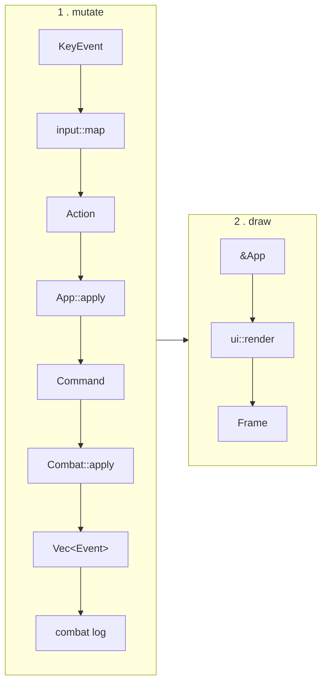

# Architecture

How the code is organised and why. For what the game *is*, see [DESIGN.md](DESIGN.md).

---

## The one principle

**A pure core inside an imperative shell.**

Everything under `game/` is plain Rust: no `ratatui`, no IO, no async, no channels, no global
state. It is the rules of the game as a set of data structures and functions. Everything that
touches a terminal lives in `ui/`, `app.rs`, and `main.rs`.

This single boundary is worth more than every other decision here combined:

- The simulation is exhaustively testable without a terminal, a PTY, or a runtime.
- The rules cannot accidentally come to depend on how they are drawn.
- Someone reading the repo cold can understand the game by reading `game/` alone.

If a type in `game/` ever needs a `ratatui` import, something has gone wrong.

---

## Data flow

State moves in one direction. Input becomes an action, actions mutate exactly one owner, and
the UI is a pure function of the result.



The two halves are separate on purpose: the loop mutates, then draws from the result. Nothing
renders during mutation, and nothing mutates during rendering — `ui::render` only ever sees
`&App`.

Three distinct vocabularies, deliberately not collapsed into one:

| Type | Meaning | Example |
|---|---|---|
| `Action` | A UI intent. May be about navigation, not the game at all. | `MoveCursor(Left)`, `OpenMap` |
| `Command` | A request to change the simulation. **Can be refused.** | `AddComponent(2)`, `CastIncantation` |
| `Event` | A statement of fact. Something that already happened. | `Damaged { target, amount }`, `Died { name }` |

Keeping `Command` and `Event` apart is what lets the combat log write itself, and it lets tests
assert on *outcomes* rather than poking at final state.

---

## Module tree

```
src/
├── main.rs                terminal setup/teardown, panic hook, error reporting
├── app.rs                 App, the loop, screen routing
├── action.rs              Action enum
├── input.rs               KeyEvent → Action, resolved per screen
│
├── game/                  ══ PURE ══ no ratatui, no IO, no async
│   ├── mod.rs
│   ├── run.rs             Run: map, position, player, progression
│   │
│   ├── map/
│   │   ├── mod.rs         Map, Node, NodeKind, edges
│   │   └── generate.rs    branching path generation
│   │
│   ├── combat/
│   │   ├── mod.rs         Combat, Phase, Command, Event, apply()
│   │   ├── incantation.rs the resolver — the heart of the game
│   │   ├── rules.rs       fusion and modifier tables
│   │   ├── resolve.rs     damage pipeline
│   │   └── ai.rs          enemy intent selection
│   │
│   ├── entity/
│   │   ├── player.rs      hp, mana, 5 spell slots
│   │   └── enemy.rs
│   │
│   ├── spell.rs           Spell = cost + element + power
│   ├── element.rs         Element
│   ├── status.rs          statuses and ticking
│   │
│   ├── encounter/         fight generation from a weighted enemy pool
│   ├── event/             map events: prompts, choices, outcomes
│   └── content/           RON loading and validation
│
└── ui/                    ══ RENDER ONLY ══ every fn takes &App
    ├── mod.rs             screen router
    ├── map.rs
    ├── combat.rs
    ├── event.rs
    ├── game_over.rs
    └── widgets/           health_bar, incantation_bar, log
```

Each axis the game is expected to grow along has exactly one home: spells and rules in
`combat/`, enemies in `encounter/`, events in `event/`, node types in `map/`, screens in `ui/`.

---

## State ownership

```
App                          the shell; owns everything, drives the loop
├── screen:  Screen          which view is active
├── run:     Run             the roguelike meta-state
│   ├── map:      Map
│   ├── position: NodeId
│   ├── player:   Player     ←── the single owner of player state
│   └── rng:      StdRng
├── combat:  Option<Combat>  exists only while inside a fight node
└── ui:      UiState         cursor, scroll, focus — view state only
```

**`Combat` does not own the player.** It holds the enemies, the in-progress incantation, and
the log, and it receives the player by reference when applying a command:

```rust
impl Combat {
    pub fn apply(&mut self, player: &mut Player, cmd: Command) -> Vec<Event>;
}
```

This is structural, not a convention. `Combat` *cannot* hold a stale copy of the player,
because it has no field to put one in.

That matters because the prototype this replaces had exactly that bug: `Player::new()` was
called twice, so `App` and `FightDisplay` each owned a different player and damage to one
would never have appeared in the other. The fix is not "be careful" — it is arranging
ownership so the mistake doesn't typecheck.

### View state vs simulation state

The distinction that decides where anything lives:

- **Simulation state** is anything the rules depend on — HP, mana, statuses, map position. One
  owner, in `game/`.
- **View state** is anything only the display cares about — which slot the cursor is on, log
  scroll offset, which panel has focus. Lives in `UiState`, and the simulation never sees it.

---

## Screens

```rust
enum Screen { Map, Combat, Event, GameOver }
```

An enum rather than `Box<dyn Screen>`. The set of screens is fixed and known, so there is
nothing to gain from dynamic dispatch — and the compiler will point at every `match` that
needs updating when a variant is added, which trait objects will not.

---

## The loop

```rust
loop {
    if event::poll(Duration::from_millis(100))? {
        if let Some(action) = input::map(event::read()?, &app) {
            app.apply(action);
        }
    }
    app.tick();                                  // drains paced effects
    terminal.draw(|f| ui::render(f, &app))?;
    if app.should_quit { break; }
}
```

Synchronous and single-threaded. A turn-based game is entirely input-driven, so async buys
nothing here — dropping `tokio` removes a heavyweight dependency and an entire class of bug
along with it.

The `poll` timeout does double duty. It stops the loop from spinning — the prototype had no
poll and emitted **9.3 MB of escape codes in two seconds**, pegging a core — and it provides a
timer for free. That timer drives `tick()`, which drains a queue of pending effects so an
enemy's turn reads as *strike → beat → damage lands* rather than resolving in one instant
frame. Pacing is what separates a turn-based game that feels alive from one that feels like a
spreadsheet.

---

## Determinism

The RNG is a seeded `StdRng` stored on `Run` and threaded explicitly — never a thread-local,
never `rand::random()`. Map generation, encounter selection, event draws, and any combat rolls
all come from it.

This costs one parameter in a few signatures and buys: reproducible tests, reproducible bug
reports, seeded runs a player can share, and a demo recording that renders identically every
time.

---

## Content loading

Content lives in `res/*.ron` and is embedded with `include_str!`, so the binary runs from any
directory rather than only from the repository root.

Parsing happens once at startup and returns `Result`, surfacing a readable error rather than
panicking. Validation is a test: every enemy referenced by an encounter exists, every element
in a rule is real, every event outcome is well-formed. That test is the regression guard for
the exact class of bug the prototype shipped, where `res/enemies.ron` carried fields the
`Enemy` struct did not have.

---

## Testing

The architecture exists in large part to make this cheap.

**Pure core — ordinary unit tests.** No terminal, no runtime, no fixtures. The resolver gets
the most attention, since it is the game. One test in particular falls straight out of the
design:

```rust
#[test]
fn resolution_is_order_independent() {
    let bag = [EMBER, GUST, EMBER];
    let expected = resolve(&bag, &rules);

    // itertools::Itertools::permutations
    for perm in bag.iter().copied().permutations(bag.len()) {
        assert_eq!(resolve(&perm, &rules), expected);
    }
}
```

That is a load-bearing design guarantee checked directly, rather than hoped for.

**UI — snapshot tests.** `ui::render` takes `&App`, so a test constructs any state it likes —
mid-fight, one enemy dead, player at 1 HP — renders through ratatui's `TestBackend`, and
asserts the exact characters drawn with `insta`. No PTY, no async.

Both are wired into CI, which runs `fmt`, `clippy -D warnings`, tests, and a release build.

---

## Alternatives considered

Recorded because the reasons matter more than the conclusions.

**A `Component` trait** — widgets owning their own state and messaging each other. Rejected.
It suits applications, but a game has a *simulation*, and simulation state is shared by
definition: player HP is needed by the player panel, the incantation preview, the AI, and the
win check. Components owning it forces you to duplicate it, pass `&mut Game` into everything
anyway, or sync via messages. The prototype did all three and ended with two `Player`s and a
`GameEvent` that was received and dropped on the floor. Components remain a good idea for
*view* state, which is what `UiState` is.

**Peer-to-peer channels between components.** Rejected. Rust makes sibling references painful,
so channels become the workaround, and then events sent this frame land next frame, ownership
of "who handles this" gets ambiguous, and you can no longer answer "what happens when I press
Enter?" by reading code.

**ECS (`bevy_ecs`, `hecs`).** Rejected as overkill. ECS earns its complexity with thousands of
homogeneous entities; this game has a player and a handful of enemies.

**`tokio` / async.** Rejected. Nothing here is IO-bound or concurrent. It was in the prototype
to service a design that no longer exists.

**Recipe-based spell combination** — authoring each combination explicitly. Rejected on content
cost: it grows quadratically with the spell count, which directly conflicts with adding spells
later. Rules keyed on elements give a new spell every existing interaction for free. See
[DESIGN.md](DESIGN.md#why-this-shape).
